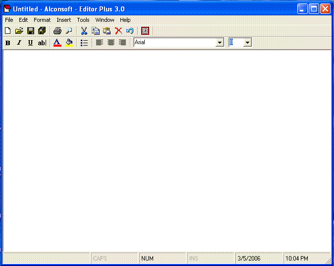



## Editor Plus 3\.0

### Description

With Alconsoft Editor Plus, you can create and edit simple text documents or documents with complex formatting and graphics.You can save your Editor Plus file as a text file, rich text file, text file for MS-DOS, Unicode. These formats provide greater flexibility when working with other programs. Documents that use multiple languages should be saved as rich text files.

If you have any suggestions or comments please email us at manojbabu@sancharnet.in

Thank You for using this software :

Alconsoft All Rights Reserved.

E-mail: manojabu@sancharnet.in

Web Site: http://www.geocities.com/alconsoft/
 
### More Info
 

             |
---                |---
**Submitted On**   |2006-02-27 21:49:02
**By**             |[MANOJBABU](https://github.com/Planet-Source-Code/PSCIndex/blob/master/ByAuthor/manojbabu.md)
**Level**          |Advanced
**User Rating**    |5.0 (15 globes from 3 users)
**Compatibility**  |VB 6\.0
**Category**       |[Complete Applications](https://github.com/Planet-Source-Code/PSCIndex/blob/master/ByCategory/complete-applications__1-27.md)
**World**          |[Visual Basic](https://github.com/Planet-Source-Code/PSCIndex/blob/master/ByWorld/visual-basic.md)
**Archive File**   |[Editor\_Plu197794352006\.zip](https://github.com/Planet-Source-Code/manojbabu-editor-plus-3-0__1-64304/archive/master.zip)

